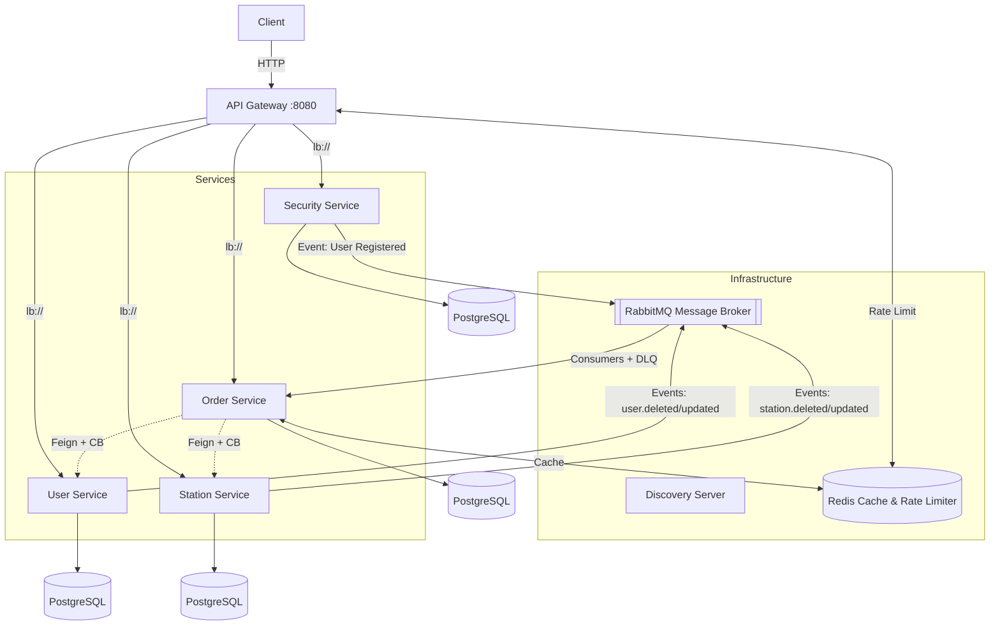

Микросервисная платформа для автоматизации СТО


3. Технологический стек (Tech Stack)

* **Core:** Java 21+, Spring Boot 3.x, Spring Data JPA
* **Microservices & Infrastructure:** Spring Cloud Gateway, Netflix Eureka (Service Discovery), Spring Cloud OpenFeign
* **Fault Tolerance & Resilience:** Resilience4j (Circuit Breaker, Time Limiter), Spring Cloud LoadBalancer
* **Databases & Caching:** PostgreSQL / MySQL, Redis (Distributed Cache & Rate Limiting)
* **Messaging (Async):** RabbitMQ (AMQP, Dead Letter Queues architecture)
* **API Documentation:** Springdoc OpenAPI / Swagger UI (агрегированный на шлюзе)
* **Containerization:** Docker, Docker Compose

4. Реализованные паттерны и паттерны отказоустойчивости

* **API Gateway & Centralized Security:** Маршрутизация всех запросов через единую точку входа с централизованной валидацией токенов и ограничением частоты запросов (**Redis Rate Limiter**).
* **Circuit Breaker & Fallbacks (Resilience4j):** Защита каскадных падений в `order-service` при вызовах `user-service` и `station-service`. Настроены изолированные окна падения и фолбэк-методы.
* **Distributed Caching & Eviction:** Оптимизация производительности за счет кэширования запросов в Redis. Реализован механизм инвалидации кэша (`evictCache`) при изменении данных.
* **Reliable Messaging:** Асинхронная синхронизация сущностей (удаление/обновление пользователей и станций) через RabbitMQ. Использование **Dead Letter Queues (DLQ)** для изоляции проблемных сообщений.

5. Быстрый запуск (Quick Start)

```markdown

1. Клонируйте репозиторий
2.Соберите jar-файлы всех микросервисов:
mvn clean package
3.Запустите всю инфраструктуру и сервисы одной командой:
docker-compose up --build -d
